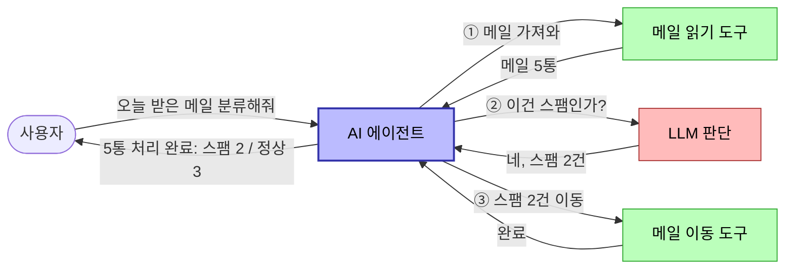
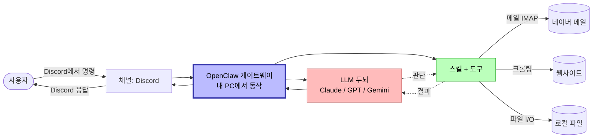
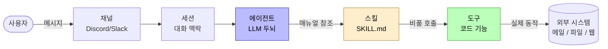

# Day 1: 환경 셋업 + 첫 에이전트
{: .no_toc }

총 4시간 (강의·실습 3시간 + Q&A 1시간)
{: .fs-5 .fw-300 }

<details open markdown="block">
<summary>목차</summary>
{: .text-delta }
1. TOC
{:toc}
</details>

## 학습 목표

- AI 에이전트와 LLM의 차이를 본인의 언어로 설명한다
- OpenClaw를 본인 PC에 설치하고 게이트웨이를 띄운다
- 가장 단순한 에이전트를 1회 실행한다
- OpenClaw의 핵심 4개 개념(채널·세션·스킬·도구)을 이해한다

## 시간표

| 시간 | 블록 | 내용 |
|---|---|---|
| 0:00–0:50 | 1 | 오프닝 / 최종 데모 시연 / AI 에이전트 vs LLM / OpenClaw란? |
| 1:00–1:50 | 2 | OpenClaw 설치 / 첫 에이전트 1회 실행 |
| 2:00–2:50 | 3 | OpenClaw 핵심 개념 (채널·세션·스킬·도구) |
| 3:00–4:00 | Q&A | 셋업 보조 + 자유 질의응답 |

---

## Block 1: AI 에이전트와 OpenClaw 개념

### LLM과 AI 에이전트의 차이

#### 한 줄 비유

| LLM | AI 에이전트 |
|:---|:---|
| **자판기** 🥤 | **신입 인턴** 👩‍💼 |
| 동전(질문)을 넣으면 음료(답)가 나오는 1회 응답기 | 목표를 주면 도구를 알아서 찾아 쓰며 끝낼 때까지 일함 |

#### 실제 제품 예시

이미 들어봤을 도구로 비교해 보자.

| LLM (단순 응답) | AI 에이전트 (도구 사용 + 자율 행동) |
|:---|:---|
| **ChatGPT** — 질문하면 답하는 챗봇 | **Claude Code** — 터미널에서 코드를 짜고, 파일을 고치고, 명령어까지 직접 실행 |
| **Claude (claude.ai)** — 텍스트 대화 | **Cursor** — IDE에서 의도를 말하면 코드를 자동으로 수정 |
| **Gemini / 클로바X** — 채팅 | **Microsoft Copilot in Office** — 워드·엑셀 안에서 직접 문서를 만들고 편집 |
| **HuggingChat** — 모델만 호출하는 데모 | **OpenClaw + 메일 비서** *(이번 강의에서 만들 것)* — 메일을 직접 읽고 분류·이동·알림 |

> 💡 **같은 모델이라도 도구가 붙으면 에이전트가 된다.**
> Claude(LLM)와 Claude Code(에이전트)는 **두뇌가 같다**. 차이는 손발(도구)을 쥐어줬느냐다. ChatGPT와 ChatGPT의 GPTs/Deep Research 관계도 똑같다.
{: .note }

#### 작동 차이를 그림으로

**LLM 단독** — 입력→출력 1턴. 외부 세계에 닿을 손이 없음.


**AI 에이전트** — LLM이 두뇌가 되고, 도구로 실제 행동을 하며, 결과를 보고 다음 행동을 결정. 일이 끝날 때까지 반복.



#### 핵심 공식

> **AI 에이전트 = LLM(판단) + 도구(행동) + 루프(반복)**
{: .important }

이번 강의에서 OpenClaw로 만들 메일 비서가 정확히 이 구조다. LLM이 메일 내용을 보고 스팸인지 **판단**하고, 도구를 써서 실제로 메일을 **이동**시키고, 결과를 Discord로 **알린다**. 이 과정이 새 메일이 올 때마다 자동으로 **반복**된다.

### OpenClaw란?

자체 호스팅 가능한 **AI 비서 게이트웨이**. 한 줄로 요약하면:

> 평소 쓰는 메신저(Discord, Telegram 등)에서 AI 비서에게 일을 시키면, 그 비서가 **내 PC 안에서** 도구를 써서 일을 끝낸 뒤 같은 메신저로 결과를 보내주는 시스템.

#### 전체 구조



#### 무엇을 만들 수 있나?

OpenClaw로 다음 같은 비서를 만들 수 있다.

- 📧 **메일 비서** — 새 메일을 분류·요약하고 Discord로 알림 *(이번 강의에서 만들 것)*
- 📰 **뉴스 모니터** — 관심사 뉴스를 매일 아침 정리해서 보내줌
- ✍️ **콘텐츠 자동 발행** — 정리한 글을 네이버 블로그에 자동 업로드
- 📊 **데이터 모니터** — 공시·주가·재고 등이 변하면 즉시 알림
- 🧹 **파일 정리** — 다운로드 폴더를 종류별로 자동 분류·백업

#### 왜 "내 PC에서 돌리는" 게 의미 있나?

기존 ChatGPT는 **남의 클라우드**에서 동작한다. 메일을 분류하려면 메일 본문을 OpenAI 서버에 보내야 한다.

OpenClaw는 **내 PC 안에서 도는 LLM 비서**다.

- 🔒 **개인 데이터 안전** — 메일·캘린더·대화 내용이 외부로 나가지 않음
- 🛠 **자유로운 확장** — 내가 만든 도구·스킬을 마음대로 추가
- 🔁 **상시 가동** — 백그라운드 데몬으로 24시간 동작, 새 메일 즉시 반응

#### 핵심 4개 개념 (Block 3에서 자세히)

| 개념 | 한 줄 설명 |
|---|---|
| **채널** | 사용자가 에이전트와 대화하는 통로 (Discord, Slack, etc.) |
| **세션** | 한 번의 대화 맥락 (메모리 단위) |
| **스킬** | 자연어 runbook 형태의 작업 가이드 (`SKILL.md`) |
| **도구** | 코드로 작성된 호출 가능한 기능 (플러그인 또는 내장) |

---

## Block 2: 설치 + 첫 에이전트

> [사전 과제](00-pre-assignment.html)에서 환경(**Windows: WSL2 + Ubuntu**, **macOS: Xcode CLT**)이 준비되었다고 가정합니다. **Windows 사용자는 모든 명령을 Ubuntu(WSL2) 셸 안에서** 실행하세요.
{: .note }

### 2-1. Node.js LTS + Git 설치

OpenClaw는 Node.js 위에서 동작합니다.

#### Ubuntu (WSL2) — Windows 사용자

`nvm`을 통해 sudo 없이 사용자 영역에 Node를 설치합니다.

```bash
# 시스템 업데이트 + 빌드 도구
sudo apt update && sudo apt upgrade -y
sudo apt install -y build-essential curl git

# nvm 설치
curl -o- https://raw.githubusercontent.com/nvm-sh/nvm/v0.39.7/install.sh | bash
source ~/.bashrc

# Node 22 LTS 설치
nvm install 22
nvm alias default 22
```

#### macOS

[Homebrew](https://brew.sh)를 쓰고 Node는 LTS로 핀합니다.

```bash
# brew 미설치라면 먼저 설치
/bin/bash -c "$(curl -fsSL https://raw.githubusercontent.com/Homebrew/install/HEAD/install.sh)"

# Node 22 LTS
brew install node@22
echo "export PATH=\"$(brew --prefix node@22)/bin:\$PATH\"" >> ~/.zshrc
source ~/.zshrc
```

> Homebrew의 `node@22`는 keg-only라 PATH에 직접 등록해야 합니다 (위 두 번째 줄). bash 사용자는 `~/.zshrc` → `~/.bash_profile`로 바꿔주세요.
{: .note }

Git이 안 떠 있으면(사전 과제에서 점검했지만 누락 시):

```bash
brew install git
```

#### 확인 (공통)

```bash
node --version    # v22.x.x
npm --version     # 10.x.x 이상
git --version     # 2.x.x
```

세 개 모두 정상 출력되면 다음 단계.

### 2-2. OpenClaw 설치

```bash
curl -fsSL https://openclaw.ai/install.sh | bash
```

`curl`로 [openclaw.ai](https://openclaw.ai)에서 `install.sh`를 받아 bash로 실행합니다. 새 셸을 열거나 `source ~/.bashrc`로 PATH를 갱신한 뒤:

```bash
openclaw --version
```

버전이 정상 출력되면 설치 성공.

### 2-3. 초기 설정 마법사

OpenClaw 첫 사용 전, 모델·게이트웨이·기본 설정을 잡습니다.

```bash
openclaw setup --wizard
```

마법사가 단계별로 묻습니다. **다음 표 그대로** 답하면 됩니다.

| 단계 | 선택 |
|---|---|
| Security disclaimer | **Yes** (개인 사용 동의) |
| Setup mode | **QuickStart** |
| Existing config 처리 | **Use existing values** (또는 처음이면 자동 진행) |
| Model/auth provider | 검색창에 `google` 입력 → **Google** 선택 (`Google Vertex` 아님) |
| API key | 사전 과제에서 받아둔 [Gemini API 키](00-pre-assignment.html#2-gemini-api-키-발급) 입력 |
| Default model | 기본값(Gemini 2.5 Flash 등) 그대로 |
| Channel | **Skip for now** (Day 4에서 Discord 연결) |
| Web search | **DuckDuckGo Search (experimental)** (무료, 키 불필요) |
| Skill 의존성 설치 | **Skip for now** (Day 2에서 메일 스킬 설치) |
| 각종 API 키 (`goplaces`, `notion`, `openai-whisper-api`, `sag` 등) | 모두 **No** |
| Hooks | **Skip for now** |
| 미사용 스킬 비활성화 | **Yes** |
| Gateway service runtime | (자동 — Node) |

마법사 끝 무렵에 **OpenClaw Gateway가 백그라운드 서비스로 자동 등록·실행**됩니다.

### 2-4. 검증 + 첫 에이전트

#### Health check

```bash
openclaw doctor
```

대부분 ✅ 통과해야 합니다. (Update 안내가 보여도 무시 가능)

#### 첫 에이전트 대화

```bash
openclaw
```

처음 진입 시 **Crestodian**(셋업 진단 에이전트)이 뜹니다. 메인 에이전트로 가려면 입력창에:

```
talk to agent
```

메인 에이전트로 전환되면 가벼운 인사:

```
안녕
```

응답이 정상으로 오면 **Day 1 완료**.

> Crestodian으로 돌아가려면 `/crestodian`. 종료는 `/exit` 또는 Ctrl+C.
{: .note }

### 2-5. (선택) Pro 구독자용 Claude CLI 경로

Anthropic Claude **Pro 구독자**라면 Gemini 대신 Claude를 쓸 수 있습니다. 별도 셋업이 필요해 강의 권장은 Gemini이며, 이 섹션은 어디까지나 **개인적 선택지**입니다.

```bash
# Claude Code CLI 설치
npm install -g @anthropic-ai/claude-code
claude --version

# OAuth 인증 (브라우저 자동으로 열림 → Pro 계정 로그인 → 승인)
claude
```

`claude` TUI에서 가벼운 인사 후 `/exit`. 그 다음 OpenClaw setup 마법사 다시 실행:

```bash
openclaw setup --wizard
```

마법사에서 **Update values** 선택 후:
- Provider → **Anthropic (Claude CLI + API key)**
- Auth method → **Claude CLI** (API key 아님)

> Windows native(WSL2 사용 안 함)에서는 Node spawn `.cmd` 이슈로 Claude CLI가 동작하지 않습니다. 반드시 **WSL2 + Ubuntu 환경**에서 사용하세요.
{: .warning }

> Claude Pro 구독은 [claude.ai](https://claude.ai) 채팅 정액 요금이고 Anthropic API와는 별도 결제입니다. Claude CLI는 Pro 구독을 사용해 API 크레딧 없이 호출할 수 있는 우회 경로입니다.
{: .note }

---

## Block 3: OpenClaw 핵심 개념

OpenClaw는 4개의 개념으로 모든 게 설명된다. **개인 비서를 둔 작은 사무실**에 비유해 보자.

| 개념 | OpenClaw 정의 | 일상 비유 |
|---|---|---|
| **채널** | 사용자와 에이전트의 입출력 통로 | 손님이 연락하는 **창구** (카톡·전화·이메일) |
| **세션** | 한 줄기 대화의 컨텍스트 단위 | 한 손님과의 **대화 한 줄기** (며칠짜리 카톡방처럼) |
| **스킬** | 자연어 작업 runbook (SKILL.md) | 직원이 따르는 **업무 매뉴얼** |
| **도구** | 코드로 호출 가능한 기능 | 직원이 손에 쥐는 **사무 비품** (프린터·전화·창고 키) |

전체 흐름:



### 채널 (Channel) — 창구

사용자가 에이전트와 대화하는 입출력 통로.

- **예**: Discord, Slack, Telegram, 터미널(CLI)
- 한 OpenClaw 게이트웨이에 **여러 채널을 동시에** 붙일 수 있음 (Discord와 Slack 둘 다 켜둬도 같은 비서가 응답)
- 채널마다 권한·필터를 따로 설정 (예: 특정 채널에서만 응답, 특정 사용자만 명령 가능)

> 비유: 사무실에 카톡·전화·이메일 창구가 모두 들어오지만 응대하는 비서는 한 명. 창구마다 "이 번호는 VIP 전용" 같은 룰을 따로 둘 수 있다.
{: .note }

### 세션 (Session) — 대화 한 줄기

한 줄기로 이어지는 대화의 컨텍스트 단위. 직전 대화를 기억하는 단위.

- DM(개인 메시지)·채널·사용자별로 세션이 분리됨
- 세션 안에서는 맥락 유지: **"방금 검색한 메일 요약해줘"** 같은 명령이 통함
- 채널마다 세션 정책을 다르게 줄 수 있음 (채널당 세션 1개 vs 사용자별 세션 분리)

> 비유: 친구 A와의 카톡방은 며칠 전 대화도 이어진다. 친구 B와의 카톡방과는 섞이지 않는다 — 각각 별도 세션이다.
{: .note }

### 스킬 (Skill) — 업무 매뉴얼

자연어로 작성된 작업 runbook. **코드 없이** 마크다운 파일로 에이전트의 행동을 정의한다.

- `SKILL.md` 파일 + (선택) 보조 스크립트
- YAML frontmatter로 이름·설명·필요한 환경변수, 마크다운 본문에 단계별 지시
- 에이전트가 사용자 메시지를 보고 적절한 스킬을 자동으로 호출

> 비유: "민원 접수 매뉴얼"처럼 직원이 따르는 업무 가이드. 새 매뉴얼 1개 = 새 스킬 1개. **이번 강의 Day 4에서 학생이 직접 SKILL.md를 작성한다.**
{: .important }

### 도구 (Tool) — 사무 비품

실제 코드로 구현된 호출 가능한 기능. 스킬은 도구를 써서 일을 끝낸다.

- **내장 도구**: `web_search`, `code_execution`, `cron`, 파일 I/O 등 OpenClaw 기본 제공
- **플러그인 도구**: TypeScript로 작성한 사용자 도구 (예: 네이버 메일 IMAP, 블로그 크롤러)
- **MCP 도구**: Model Context Protocol을 통해 연결된 외부 도구

> 비유: 매뉴얼이 "프린터로 출력해라" 하면 직원은 실제로 프린터(도구)를 작동시킨다. 매뉴얼 = 스킬, 프린터 = 도구.
{: .note }

---

## Day 1 산출물

- [ ] 모든 학생 PC에서 OpenClaw 게이트웨이 정상 시작
- [ ] 모든 학생이 에이전트와 1회 이상 대화 성공
- [ ] 4개 핵심 개념을 본인 언어로 설명 가능

다음: Day 2: 네이버 메일 연동 *(작성 예정)*
