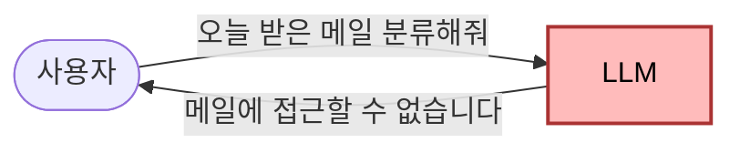

# Day 1: 환경 셋업 + 첫 에이전트
{: .no_toc }

총 4시간 (강의·실습 3시간 + Q&A 1시간)
{: .fs-5 .fw-300 }

<details open markdown="block">
<summary>목차</summary>
{: .text-delta }
1. TOC
{:toc}
</details>

## 학습 목표

- AI 에이전트와 LLM의 차이를 본인의 언어로 설명한다
- OpenClaw를 본인 PC에 설치하고 게이트웨이를 띄운다
- 가장 단순한 에이전트를 1회 실행한다
- OpenClaw의 핵심 4개 개념(채널·세션·스킬·도구)을 이해한다

## 시간표

| 시간 | 블록 | 내용 |
|---|---|---|
| 0:00–0:50 | 1 | 오프닝 / 최종 데모 시연 / AI 에이전트 vs LLM / OpenClaw란? |
| 1:00–1:50 | 2 | OpenClaw 설치 / 첫 에이전트 1회 실행 |
| 2:00–2:50 | 3 | OpenClaw 핵심 개념 (채널·세션·스킬·도구) / clawhub 둘러보기 |
| 3:00–4:00 | Q&A | 셋업 보조 + 자유 질의응답 |

---

## Block 1: AI 에이전트와 OpenClaw 개념

### LLM과 AI 에이전트의 차이

#### 한 줄 비유

| LLM | AI 에이전트 |
|:---|:---|
| **자판기** 🥤 | **신입 인턴** 👩‍💼 |
| 동전(질문)을 넣으면 음료(답)가 나오는 1회 응답기 | 목표를 주면 도구를 알아서 찾아 쓰며 끝낼 때까지 일함 |

#### 실제 제품 예시

이미 들어봤을 도구로 비교해 보자.

| LLM (단순 응답) | AI 에이전트 (도구 사용 + 자율 행동) |
|:---|:---|
| **ChatGPT** — 질문하면 답하는 챗봇 | **Claude Code** — 터미널에서 코드를 짜고, 파일을 고치고, 명령어까지 직접 실행 |
| **Claude (claude.ai)** — 텍스트 대화 | **Cursor** — IDE에서 의도를 말하면 코드를 자동으로 수정 |
| **Gemini / 클로바X** — 채팅 | **Microsoft Copilot in Office** — 워드·엑셀 안에서 직접 문서를 만들고 편집 |
| **HuggingChat** — 모델만 호출하는 데모 | **OpenClaw + 메일 비서** *(이번 강의에서 만들 것)* — 메일을 직접 읽고 분류·이동·알림 |

> 💡 **같은 모델이라도 도구가 붙으면 에이전트가 된다.**
> Claude(LLM)와 Claude Code(에이전트)는 **두뇌가 같다**. 차이는 손발(도구)을 쥐어줬느냐다. ChatGPT와 ChatGPT의 GPTs/Deep Research 관계도 똑같다.
{: .note }

#### 작동 차이를 그림으로

**LLM 단독** — 입력→출력 1턴. 외부 세계에 닿을 손이 없음.



**AI 에이전트** — LLM이 두뇌가 되고, 도구로 실제 행동을 하며, 결과를 보고 다음 행동을 결정. 일이 끝날 때까지 반복.


#### 핵심 공식

> **AI 에이전트 = LLM(판단) + 도구(행동) + 루프(반복)**
{: .important }

이번 강의에서 OpenClaw로 만들 메일 비서가 정확히 이 구조다. LLM이 메일 내용을 보고 스팸인지 **판단**하고, 도구를 써서 실제로 메일을 **이동**시키고, 결과를 Discord로 **알린다**. 이 과정이 새 메일이 올 때마다 자동으로 **반복**된다.

### OpenClaw란?

자체 호스팅 가능한 **AI 비서 게이트웨이**. 사용자가 평소 쓰는 메신저(Discord, Telegram 등) 채널을 입출력으로 두고, 그 뒤에서 LLM 에이전트가 도구·스킬을 사용해 요청을 처리.

핵심 4개 개념(Block 3에서 자세히):

| 개념 | 한 줄 설명 |
|---|---|
| **채널** | 사용자가 에이전트와 대화하는 통로 (Discord, Slack, etc.) |
| **세션** | 한 번의 대화 맥락 (메모리 단위) |
| **스킬** | 자연어 runbook 형태의 작업 가이드 (`SKILL.md`) |
| **도구** | 코드로 작성된 호출 가능한 기능 (플러그인 또는 내장) |

---

## Block 2: 설치 + 첫 에이전트

> 이 섹션의 명령은 **Windows 10 기준**입니다. macOS/Linux 사용자는 일부 명령이 다릅니다.
{: .note }

### 2-1. 사전 확인

[사전 과제](00-pre-assignment.html)에서 Node.js를 설치했어야 합니다.

```powershell
node --version    # v20.x.x 이상
npm --version
```

### 2-2. OpenClaw 설치

> ⏳ 이 섹션은 실제 VM 검증 후 정확한 명령으로 갱신됩니다. 현재 가설:
{: .warning }

```powershell
npm install -g openclaw
openclaw --version
```

### 2-3. 초기 설정 마법사

```powershell
openclaw doctor
```

`doctor`는 누락된 의존성·설정을 점검합니다. `--fix` 옵션을 추가하면 자동으로 고칠 수 있는 항목을 처리합니다.

### 2-4. 게이트웨이 시작

```powershell
openclaw gateway start
```

> ⏳ VM 검증 후 갱신: 게이트웨이 시작 후 어떤 화면이 보이는지, 종료 방법, 백그라운드 실행 옵션 등.
{: .warning }

### 2-5. 첫 에이전트 실행

> ⏳ VM 검증 후 갱신: 첫 명령(예: 인사 받기, 간단한 도구 사용) 시연.
{: .warning }

---

## Block 3: OpenClaw 핵심 개념

### 채널 (Channel)

사용자가 에이전트와 대화하는 입출력 통로.

- 예: **Discord**, **Slack**, **Telegram**, **CLI(터미널)**
- 한 OpenClaw 게이트웨이에 여러 채널을 동시에 붙일 수 있음
- 채널마다 권한·필터를 따로 설정 (예: 특정 채널에서만 응답)

### 세션 (Session)

한 번의 연속된 대화 맥락. 에이전트가 직전 대화를 기억하는 단위.

- DM(개인 메시지)별로 세션이 분리됨
- 세션 안에서는 컨텍스트 유지 (예: "방금 검색한 메일 요약해줘")
- 채널마다 세션 정책을 다르게 줄 수 있음

### 스킬 (Skill)

자연어로 작성된 작업 runbook. 코드를 짜지 않고도 에이전트의 행동 패턴을 정의 가능.

- `SKILL.md` 파일 + (선택) 보조 스크립트
- YAML frontmatter로 메타데이터, 마크다운 본문에 단계별 지시
- 에이전트가 적절한 상황에 자동으로 호출

### 도구 (Tool)

실제 코드로 구현된 호출 가능한 기능. 스킬은 도구를 사용해 일을 끝낸다.

- **내장 도구**: `web_search`, `code_execution`, `cron`, 파일 I/O 등
- **플러그인 도구**: TypeScript로 작성한 사용자 도구
- **MCP 도구**: Model Context Protocol을 통해 연결된 외부 도구

### clawhub 살펴보기

`clawhub`은 OpenClaw 스킬·플러그인 카탈로그입니다.

> ⏳ VM 검증 후 갱신: `clawhub` 명령 동작 확인 + 사용 가능 스킬 리스트 캡처.
{: .warning }

---

## Day 1 산출물

- [ ] 모든 학생 PC에서 OpenClaw 게이트웨이 정상 시작
- [ ] 모든 학생이 에이전트와 1회 이상 대화 성공
- [ ] 4개 핵심 개념을 본인 언어로 설명 가능

다음: Day 2: 네이버 메일 연동 *(작성 예정)*
