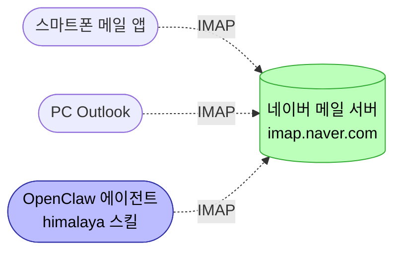

# Day 2: 네이버 메일 연동
{: .no_toc }

총 4시간 (강의·실습 3시간 + Q&A 1시간)
{: .fs-5 .fw-300 }

<details open markdown="block">
<summary>목차</summary>
{: .text-delta }
1. TOC
{:toc}
</details>

## 학습 목표

- IMAP 개념을 본인 언어로 설명한다
- OpenClaw에 메일 스킬(`himalaya`)을 설치하고 활성화한다
- `himalaya` CLI로 네이버 메일에 자격증명을 등록·연결한다
- OpenClaw 에이전트에게 메일 명령(예: "내 메일 10통 제목 보여줘")을 시켜 자동 응답을 받는다

## 시간표

| 시간 | 블록 | 내용 |
|---|---|---|
| 0:00–0:50 | 1 | IMAP 개념 / `himalaya` 스킬·CLI 설치 |
| 1:00–1:50 | 2 | `himalaya account configure` 마법사 / 비밀번호 저장 |
| 2:00–2:50 | 3 | `himalaya envelope list` 검증 / OpenClaw 에이전트 메일 명령 |
| 3:00–4:00 | Q&A | 디버깅 + 자유 질의응답 |

---

## Block 1: 메일 스킬 + CLI 설치

### IMAP이란?

**IMAP** (Internet Message Access Protocol)은 메일을 **메일 서버에 보관한 채로** 여러 기기·앱이 같은 받은 편지함을 공유하는 방식의 메일 프로토콜이다.

스마트폰에서 메일을 읽거나 별표를 달면 PC 메일 앱·웹메일에도 즉시 같은 상태가 보이고, 한 곳에서 메일을 분류·이동해도 모든 기기에 동기화된다. 이번 강의의 OpenClaw 에이전트도 IMAP을 통해 네이버 메일 서버에 연결되므로, 에이전트가 처리한 결과가 평소 쓰는 메일 앱에 그대로 반영된다.



**POP3와 비교**:

- **POP3**: 한 번 받으면 그 기기로 다운로드되고 서버에서 사라짐. 다른 기기에선 못 봄.
- **IMAP**: 메일이 서버에 머물러 모든 기기가 같은 받은 편지함을 본다.

### OpenClaw `himalaya` 스킬

OpenClaw 번들에 `himalaya` 스킬이 포함돼 있습니다 (IMAP·SMTP 메일 클라이언트 CLI를 래핑).

상태 확인:

```bash
openclaw skills info himalaya
```

`△ Needs setup`이면 워크스페이스에 설치:

```bash
openclaw skills install himalaya
```

다시 확인하면 상태가 바뀌지만, 보통 `Requirements: Binaries: ✗ himalaya`로 표시됩니다 — `himalaya` 바이너리 자체는 별도 설치 필요.

### himalaya CLI 설치

#### Linux / WSL Ubuntu

```bash
curl -sSL https://raw.githubusercontent.com/pimalaya/himalaya/master/install.sh | PREFIX=~/.local sh
```

설치 후 PATH 등록:

```bash
grep -qxF 'export PATH="$HOME/.local/bin:$PATH"' ~/.bashrc \
    || echo 'export PATH="$HOME/.local/bin:$PATH"' >> ~/.bashrc
source ~/.bashrc
```

#### macOS

```bash
brew install himalaya
```

#### 검증 (공통)

```bash
himalaya --version           # himalaya 1.x.x
openclaw skills info himalaya # ✓ Ready, Visible to model: yes
```

`✓ Ready`로 바뀌면 OpenClaw가 이제 메일 도구를 가진 상태.

---

## Block 2: 네이버 계정 설정

> **🔑 시작 전 사전 요건 확인**
> 마법사 실행 전에 다음 두 가지가 네이버에서 이미 완료되어 있어야 합니다 ([기본 설정](00-pre-assignment.html#3-네이버-메일-imap--앱-비밀번호)에서 안내된 항목):
>
> 1. **네이버 2단계 인증 활성화** — 보안 설정에서 ON
> 2. **네이버 메일 IMAP/SMTP 사용 — 사용함** — 환경설정 → POP3/IMAP 설정 탭에서 체크 + **저장**
> 3. **애플리케이션 비밀번호 발급** — "메일 (POP3/IMAP/SMTP)" 용도로 발급받은 **12자리** 비밀번호 메모장에 복사해두기
>
> 위 세 가지 없이 마법사를 돌리면 인증이 무조건 실패합니다. 못 하셨으면 [기본 설정 페이지](00-pre-assignment.html#3-네이버-메일-imap--앱-비밀번호)부터 끝내고 돌아오세요.
{: .important }

### 마법사 실행

```bash
himalaya account configure naver
```

대화형 마법사가 단계별로 묻습니다. **다음 표 그대로** 답변하세요.

| 단계 | 답변 |
|---|---|
| Email address | `<본인ID>@naver.com` |
| Should this account be the default? | **Yes** |
| Account name | `naver` (자유) |
| Full display name | 자유 (예: 본인 이름) |
| Downloads directory | 기본값 (`~/Downloads`) |
| Default backend | **IMAP** |
| IMAP hostname | `imap.naver.com` |
| **IMAP encryption** | **SSL/TLS** ⚠️ |
| IMAP port | `993` |
| IMAP login | `<본인ID>` (이메일 아닌 **ID만**) |
| IMAP authentication strategy | OS에 따라 ↓ |

#### IMAP/SMTP authentication strategy 선택 가이드

| 환경 | 선택 |
|---|---|
| **WSL Ubuntu** | "Use a shell command to retrieve my password (recommended)" — Block 3에서 파일 기반으로 전환 |
| **macOS / Linux Desktop** | "Use a shell command to retrieve my password (recommended)" — Block 3에서 키링에 저장 |

이어지는 SMTP 단계도 동일 패턴:

| 단계 | 답변 |
|---|---|
| Backend for sending | **SMTP** |
| SMTP hostname | `smtp.naver.com` |
| **SMTP encryption** | **SSL/TLS** ⚠️ |
| SMTP port | `465` |
| SMTP login | IMAP과 동일 |
| SMTP authentication | IMAP과 동일 방식 |

> ⚠️ **encryption은 반드시 `SSL/TLS`** — 포트 993/465는 SSL/TLS 전용 포트입니다. `None`으로 두면 네이버 서버가 거부합니다.
{: .warning }

마법사 끝나면 `~/.config/himalaya/config.toml`이 생성됩니다.

---

## Block 3: 비밀번호 저장

[기본 설정](00-pre-assignment.html#3-네이버-메일-imap--앱-비밀번호)에서 발급받은 **네이버 앱 비밀번호**를 himalaya가 조회할 수 있게 저장합니다. OS·환경별로 분기됩니다.

### WSL Ubuntu (파일 기반)

WSL Ubuntu는 GUI 세션이 없어 GNOME Keyring/DBus가 안 떠 있습니다. `secret-tool` 호출 시 다음 에러가 납니다:

```
secret-tool: The name org.freedesktop.secrets was not provided by any .service files
```

→ 비밀번호를 파일에 저장하고 config.toml에서 `cat`으로 조회합니다.

```bash
# 1) 비밀번호 파일 저장 (권한 600 — 본인만 읽기/쓰기)
mkdir -p ~/.config/himalaya
printf '%s' '앱비밀번호' > ~/.config/himalaya/.naver-pass
chmod 600 ~/.config/himalaya/.naver-pass

# 2) 길이 검증 — 발급받은 비밀번호 글자 수와 일치해야 함
cat ~/.config/himalaya/.naver-pass | wc -c

# 3) config.toml의 secret-tool 명령을 cat으로 교체
sed -i "s|secret-tool lookup account [a-z_]* service himalaya-[a-z]*|cat $HOME/.config/himalaya/.naver-pass|g" \
    ~/.config/himalaya/config.toml

# 4) 변경 확인 — 두 줄 모두 cat 명령으로 바뀌어야 정상
grep "auth.command" ~/.config/himalaya/config.toml
```

> `printf '%s'`를 쓰면 끝에 줄바꿈이 안 붙어 정확히 비밀번호 글자수만 저장됩니다. 인터랙티브 입력 시 글자 누락·줄바꿈 추가가 자주 발생합니다.
{: .important }

### macOS / Linux Desktop (키링)

GUI 세션이 있는 환경(macOS, Ubuntu Desktop)은 키링을 사용할 수 있습니다.

#### Linux Desktop

```bash
# libsecret-tools 미설치 시
sudo apt install -y libsecret-tools

# IMAP·SMTP 비밀번호 저장
printf '%s' '앱비밀번호' | secret-tool store --label="himalaya naver imap" \
    account naver service himalaya-imap
printf '%s' '앱비밀번호' | secret-tool store --label="himalaya naver smtp" \
    account naver service himalaya-smtp

# 길이 검증
secret-tool lookup account naver service himalaya-imap | wc -c
```

#### macOS

macOS는 Keychain을 자동 사용합니다. 마법사가 인증 단계에서 Keychain 옵션을 제시하면 그쪽으로 진행하면 됩니다. 또는 secret-tool 호환 방식으로 저장하려면 `libsecret`을 brew로 설치 후 위와 동일 명령.

> 키링 lookup이 발급받은 비밀번호 길이와 다르면 (예: 12자리인데 10자리만 저장됨) 인터랙티브 입력 중 글자 누락이 일어난 것. 다시 `secret-tool clear` + `printf '%s' | secret-tool store`로 깨끗히 재저장하세요.
{: .warning }

---

## Block 4: 검증

### 1) `himalaya`로 메일 목록 (셸 검증)

```bash
himalaya envelope list
```

받은 편지함 최근 메일이 표 형태로 떠야 정상:

```
| ID    | FLAGS | SUBJECT                | FROM     | DATE                   |
|-------|-------|------------------------|----------|------------------------|
| 23250 |  *    | 2단계 인증을 위한...   | 네이버   | 2026-05-08 18:00+09:00 |
| 23249 |       | 2단계 인증 로그인이... | 네이버   | 2026-05-08 17:52+09:00 |
| ...                                                                       |
```

### 2) OpenClaw 에이전트로 메일 명령

```bash
openclaw
```

→ Crestodian 진단 에이전트 화면에서 `talk to agent` 입력 → 메인 에이전트로 전환 후:

```
내 메일 10통 제목 보여줘
```

에이전트가 자동으로 `himalaya` 스킬을 호출해 같은 표 형태로 응답해야 정상입니다.

### 3) 좀 더 복잡한 명령

동작 잘 되면 다음도 시도:

```
"네이버"에서 온 메일만 필터링해서 보여줘
```

```
가장 최근 메일 본문을 요약해줘
```

```
오늘 받은 메일이 몇 통인지 알려줘
```

---

## 트러블슈팅

### "Authentication failed. Please check IMAP/SMTP settings in the webmail"

네이버 웹메일에서 IMAP/SMTP가 **사용 안 함**으로 되어 있습니다. [기본 설정 — 네이버 메일 IMAP](00-pre-assignment.html#3-네이버-메일-imap--앱-비밀번호)으로 돌아가 활성화 + **저장 버튼** 클릭 후 재시도.

### "Authentication failed. Please check your username, password"

네이버가 인증 정보를 거부한 것. 다음 순서로 점검:

1. **비밀번호 길이 검증** — `wc -c`로 발급받은 글자 수와 정확히 일치하는지
2. **login 형식** — `xodnjs9850`(ID만) vs `xodnjs9850@naver.com`(전체) 둘 다 시도
3. **2단계 인증** — 네이버 보안 설정에서 ON 상태인지
4. **앱 비밀번호 재발급** — [네이버 앱 비밀번호 페이지](https://nid.naver.com/user2/help/myInfo.nhn?menu=pwdAlone)에서 폐기 후 새로 발급

### "secret-tool: org.freedesktop.secrets was not provided"

WSL Ubuntu에서 키링 미가동. 위 [Block 3 — WSL Ubuntu (파일 기반)](#wsl-ubuntu-파일-기반) 섹션으로 전환.

### IMAP encryption을 `None`으로 설정해서 연결 안 됨

config.toml의 `encryption.type`을 `tls`로 수정 (또는 마법사 재실행 후 SSL/TLS 선택):

```bash
sed -i 's|encryption.type = "none"|encryption.type = "tls"|g' ~/.config/himalaya/config.toml
```

### 키링에 저장한 비밀번호 글자가 누락됨

인터랙티브 입력 시 클립보드 복사가 일부 글자만 들어가는 케이스. `printf '%s'`로 다시 저장:

```bash
secret-tool clear account naver service himalaya-imap
printf '%s' '앱비밀번호' | secret-tool store --label="himalaya naver imap" \
    account naver service himalaya-imap

# 길이 재확인
secret-tool lookup account naver service himalaya-imap | wc -c
```

---

## Day 2 산출물

- [ ] 모든 학생이 `himalaya envelope list`로 본인 네이버 메일 목록 조회 성공
- [ ] OpenClaw 에이전트에 자연어 메일 명령("내 메일 10통 제목 보여줘") → himalaya 스킬 자동 호출 + 응답 성공
- [ ] IMAP·앱 비밀번호·키링 vs 파일 기반 차이를 본인 언어로 설명 가능

다음: Day 3: 스팸 분류 + cron 자동 파이프라인 *(작성 예정)*
