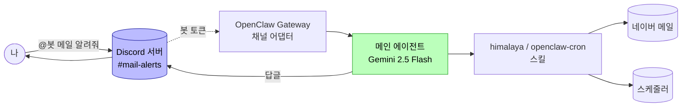
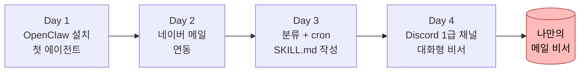

# Day 4: Discord 연결 + 대화형 비서
{: .no_toc }

총 4시간 (강의·실습 3시간 + Q&A 1시간)
{: .fs-5 .fw-300 }

<details open markdown="block">
<summary>목차</summary>
{: .text-delta }
1. TOC
{:toc}
</details>

## 학습 목표

- Discord 채널을 OpenClaw에 1급 채널로 등록한다
- 봇 토큰을 셸 재시작 후에도 자동 로드되게 영속화한다
- Discord 채널 안에서 자연어로 메일 조회·요약을 처리한다
- Day 3에서 만든 cron 자동화를 **자연어로 운영**(상태 확인·주기 수정·수신자 지정·수동 실행)한다
- cron 실행 결과를 Discord 채널로 자동 알림 받는 최종 파이프라인을 완성한다

## 시간표

| 시간 | 블록 | 내용 |
|---|---|---|
| 0:00–0:50 | 1 | Discord 채널 등록 / 봇 토큰 영속화 / Gateway 첫 기동 |
| 1:00–1:50 | 2 | 첫 대화 / 자연어 메일 조회·요약·이동 |
| 2:00–2:50 | 3 | 자연어로 cron 운영 + Discord 알림 자동화 (클라이맥스) |
| 3:00–4:00 | Q&A | 트러블슈팅 + 강의 전체 회고 |

---

## 사전 확인

- Day 1~3 완료: OpenClaw 설치, Gemini 연동, 네이버 메일 연동, 스팸 분류 cron 동작 검증
- [기본 설정](00-pre-assignment.html) 5단계 완료: Discord 봇 생성 + 토큰 + 본인 서버 초대
- 봇 인텐트 3종 ON: **PRESENCE / SERVER MEMBERS / MESSAGE CONTENT**

> 봇 토큰을 분실했으면 Developer Portal → Bot → **Reset Token** 으로 새로 발급. 이전 토큰은 자동 무효화됩니다.
{: .note }

---

## Block 1: Discord 채널 등록 + 토큰 영속화

### 왜 "1급 채널"인가

지금까지 강의에서 OpenClaw 에이전트와 대화한 곳은 모두 터미널이었습니다. Day 4에서는 같은 에이전트가 **Discord 채널 자체를 입출력 통로**로 갖게 됩니다. 메일·cron 같은 도구를 부르는 두뇌는 그대로, **앞단의 대화창만 Discord로** 바뀌는 구조입니다.



### 1-1. 봇 토큰을 환경변수로 공급

OpenClaw는 토큰을 평문으로 설정 파일에 박지 않습니다. 대신 **환경변수 참조(env-ref)** 방식을 씁니다. OpenClaw는 "이 채널의 토큰은 `DISCORD_BOT_TOKEN` 환경변수에서 읽어와" 라는 지시만 가지고, 실제 값은 매번 실행 시점에 환경에서 가져옵니다.

먼저 셸에 한 번 export:

```bash
export DISCORD_BOT_TOKEN="여기에_실제_봇_토큰_붙여넣기"
```

### 1-2. Discord 채널을 OpenClaw에 등록

```bash
openclaw config set channels.discord.token \
  --ref-provider default \
  --ref-source env \
  --ref-id DISCORD_BOT_TOKEN
```

설정이 들어갔는지 확인:

```bash
openclaw config get channels.discord
```

`token.refSource: env`, `refId: DISCORD_BOT_TOKEN` 이 보이면 정상.

> 토큰 값 자체는 출력에 안 나옵니다. 이게 정상이에요(평문 저장 안 함).
{: .note }

### 1-3. 토큰 영속화 — 셸/Ubuntu 재시작 후에도 살아있게

`export` 만 쓰면 **셸 창을 닫거나 WSL을 재시작하는 순간 토큰이 날아갑니다**. 매번 다시 입력하지 않도록 토큰을 파일로 저장하고 셸이 열릴 때 자동 로드되게 만듭니다.

#### 시크릿 파일 만들기

```bash
mkdir -p ~/.openclaw/secrets

cat > ~/.openclaw/secrets/discord.env <<'EOF'
export DISCORD_BOT_TOKEN="여기에_실제_봇_토큰_붙여넣기"
EOF

chmod 600 ~/.openclaw/secrets/discord.env
```

`chmod 600` 은 **본인 외 다른 사용자는 읽기도 못 함**을 의미합니다. 같은 PC를 가족과 공유해도 토큰이 노출되지 않아요.

> `<<'EOF'` 의 작은따옴표가 중요합니다. 없으면 `$DISCORD_BOT_TOKEN` 같은 표현이 미리 치환되어 빈 값으로 저장될 수 있습니다.
{: .warning }

#### `~/.bashrc` 에서 자동 로드

```bash
cat >> ~/.bashrc <<'EOF'

# OpenClaw secrets
[ -f ~/.openclaw/secrets/discord.env ] && . ~/.openclaw/secrets/discord.env
EOF
```

`[ -f ... ] && . ...` 은 "파일이 있으면 source(불러오기)" 라는 뜻입니다. 파일이 지워져도 셸 자체는 정상 시작됩니다.

#### 현재 셸에 즉시 적용 + 검증

```bash
source ~/.bashrc
echo "${DISCORD_BOT_TOKEN:0:10}..."
```

`MTM4xxxxxx...` 처럼 토큰 앞 10자가 보이면 정상.

#### 재시작 시뮬레이션 (선택)

PowerShell 관리자에서:

```powershell
wsl --shutdown
```

다시 Ubuntu를 열고:

```bash
echo "${DISCORD_BOT_TOKEN:0:10}..."
```

토큰이 그대로 떠 있으면 **앞으로 매번 `export` 다시 칠 필요 없음**.

### 1-4. Gateway 기동

```bash
openclaw gateway
```

로그에 다음 세 줄이 떠야 정상:

```
[gateway] starting...
[gateway] ready
[discord] connected as MailAssistant#1234
[discord] guild=<내 서버 이름> ready
```

Discord 클라이언트에서 본인 서버 멤버 목록을 보면 봇이 **온라인(녹색)** 으로 떠 있어야 합니다.

> Day 1에서는 `openclaw gateway start` (백그라운드)로 했지만, Discord 채널 어댑터가 안정적으로 토큰을 잡으려면 강의 중에는 **`openclaw gateway` (foreground)** 로 별도 터미널에서 띄워두기를 권장합니다. 로그도 실시간으로 보이고 디버깅이 쉬워요.
{: .note }

---

## Block 2: 첫 대화 — 메일을 자연어로 다루기

### 2-1. 봇에게 말 거는 두 가지 방식

| 위치 | 멘션 필요 | 용도 |
|---|---|---|
| 서버 채널 (예: `#mail-alerts`) | ✅ `@봇이름` | 다른 사람과 공용 채널일 때 봇을 명시 호출 |
| 봇과의 1:1 DM | ❌ 본문만 | 본인만의 비서, 가장 단순 |

강의 진행은 서버 채널 + 멘션 기준으로 합니다 (cron 결과 알림이 이 채널로 오기 때문).

### 2-2. 시나리오 1 — 자기 소개

`#mail-alerts` 채널에서:

```
@MailAssistant 연동된 메일이 뭐야?
```

봇 응답 예시:

```
연동된 메일은 xxx@naver.com (네이버 메일)이에요
  - 계정 이름: naver
  - 백엔드: IMAP (수신) + SMTP (발신)
  - 기본 계정으로 설정됨
```

> 가끔 봇이 첫 한두 마디에 다른 메일 서비스(예: gmail)를 말하고 곧바로 정정하는 경우가 있습니다. Gemini의 환각 현상이며, **두 번째 응답부터는 도구를 실제로 호출**해 정확해집니다.
{: .note }

### 2-3. 시나리오 2 — 최신 메일 요약

```
@MailAssistant 가장 최신 메일 요약해줘
```

기대 동작:

1. `himalaya envelope list -a naver -s 1` 으로 최신 1통 envelope
2. `himalaya message read ...` 로 본문
3. Gemini가 사람 톤으로 요약

응답 예시:

```
가장 최신 메일 요약
  • 제목: 휴면회원 개인정보 파기 예정 안내
  • 발신: membership@example.co.kr
  • 수신: 2026-05-12 16:07

본문 요약: 1년 이상 미이용 휴면 회원의 정보가 6월 11일에 파기될 예정.
계정 유지하려면 그 전에 한 번 로그인하면 돼요.
```

Gateway 터미널에는 다음과 같은 흐름이 떠야 합니다:

```
[discord] msg from <user> in #mail-alerts: "가장 최신 메일 요약해줘"
[session] new session sess_xxxx
[skill] himalaya: envelope list -a naver -s 1
[skill] himalaya: message read 12345
[infer] model=gemini-2.5-flash tokens=...
[discord] reply sent (612 chars)
```

`[skill] himalaya: ...` 가 떠야 **실제 도구가 호출된 것**입니다. 안 뜨면 LLM이 환각으로 답한 거예요.

### 2-4. 시나리오 3 — 폴더별 조회

```
@MailAssistant ai-test 폴더에 뭐 들어있어?
```

기대 동작: `himalaya envelope list -a naver -f ai-test` 호출 + 자연어 요약.

이 시점부터 학생은 **봇이 단순 챗봇이 아니라 메일 도구를 직접 부르는 비서**라는 걸 체감하게 됩니다.

---

## Block 3: 자연어로 cron 운영 + Discord 알림 자동화

이 블록이 4일 강의의 **클라이맥스** 입니다. Day 3에서 등록한 자동 분류 cron을 **Discord 채널에서 자연어로 운영**하고, 그 결과까지 자동으로 Discord로 받습니다.

### 3-1. 시나리오 4 — 스케줄 확인

```
@MailAssistant 스케줄 확인해줘
```

봇이 Day 3에서 만든 `openclaw-cron` SKILL을 발동시켜 다음과 같이 응답:

```
현재 스케줄

| 이름        | 주기    | 다음 실행  | 마지막 실행 | 상태       |
|------------|--------|-----------|-----------|-----------|
| spam-filter | 5분마다 | 58분 후    | 3분 전     | ⚠️ error |

문제 발생 중
 • spam-filter 작업이 error 상태예요
 • 전송 경로(delivery)에 문제가 있어 보여요
 • 다음 실행이 5분 뒤가 아니라 58분 뒤로 잡혀있는 것도 에러로 인한 백오프로 보여요

자세한 에러 로그 확인하거나 스케줄 수정하실래요?
```

> 학생이 cron CLI 옵션을 외울 필요가 **전혀 없습니다**. Day 3에서 만든 `~/.openclaw/workspace/skills/openclaw-cron/SKILL.md` 한 장이 봇의 "스케줄 운영 능력"을 통째로 정의해두었기 때문입니다. 이게 Day 3에서 강조한 **"자연어 SKILL.md = 에이전트의 새 능력"** 패턴이 실제로 동작하는 모습이에요.
{: .important }

### 3-2. 시나리오 5 — 에러 로그 진단

```
@MailAssistant 자세한 에러 로그 보여줘
```

봇은 cron 로그를 읽고 **에러 패턴을 분리해서 진단**합니다:

```
에러 패턴 2가지

가장 최근 — Gemini 사용량 한도
  → 무료 티어 분당 15회 / 일 1500회 한도 초과

그 이전 (반복) — Discord 수신자 미지정
  Discord recipient is required.
  Use "channel:<id>" for channels or "user:<id>" for DMs.

→ 결과를 보낼 Discord 대상이 지정 안 됨 (channel:last 인데 last 경로가 없음)
```

### 3-3. 시나리오 6 — 주기 수정

```
@MailAssistant spam-filter 5분 주기가 아니라 1시간으로 수정해줘
```

봇 응답:

```
수정 완료

| 항목     | 변경 전     | 변경 후     |
|---------|------------|------------|
| 주기     | every 5m   | every 1h   |
| 다음 실행 | —          | 54분 후    |
```

내부적으로는 `openclaw cron edit --id <uuid> --schedule "every 1h"` 가 실행됩니다. 학생은 그저 한국어로 말하면 끝.

### 3-4. 시나리오 7 — Discord 수신자 자동 지정

cron 결과가 어디로 갈지 정하는 단계. 봇에게 **현재 채널을 그대로** 지정시킵니다:

```
@MailAssistant 디스코드 수신자 너로 지정하자
```

봇 응답:

```
Discord 수신자 지정 완료
지금 우리가 대화하고 있는 이 채널로 결과가 오도록 설정했어요

delivery:
  channel: discord
  to: channel:1503649409223626892  ← 이 채널
```

봇이 **자기가 호출된 채널의 ID를 스스로 인식**하고 cron delivery에 박아 넣는 모습입니다. 학생이 채널 ID를 따로 복사해 붙여넣을 필요 없음.

> Day 3에서 cron을 등록할 때 delivery를 명시하지 않으면 기본값이 `channel:last` 로 잡힙니다. 첫 실행 전이라 "last" 가 가리킬 채널이 없어 라우트 에러가 납니다. 이 단계에서 명시적으로 채널을 박아두면 해결돼요.
{: .warning }

### 3-5. 시나리오 8 — 수동 실행

```
@MailAssistant 지금 한번 실행해봐
```

봇 응답:

```
수동 실행 트리거 완료
runId: manual:de9ce27f-...:1778573078339:1

격리 세션에서 LLM이 메일 검사하는 데 보통 15~40초 정도 걸려요.
잠시 후 이 채널로 결과가 도착할 거예요.
```

성공 시 잠시 뒤 같은 채널에 별도 메시지가 자동으로 옵니다:

```
[spam-filter] 2026-05-12 17:00 결과
검사: 3통, 스팸: 1통, ham: 2통
이동 완료: 1통 → ai-test
```

여기까지 오면 **"메일이 오면 → 자동 분류 → Discord로 결과 알림"** 이라는 4일 강의의 최종 파이프라인이 완성된 상태입니다.

---

## 강의 전체 회고



- **Day 1** — 에이전트의 두뇌(LLM) 와 손발(스킬/도구) 구조 이해
- **Day 2** — 외부 서비스(네이버 IMAP)를 스킬로 연결
- **Day 3** — **SKILL.md 한 장으로 에이전트의 능력을 늘리는** OpenClaw 고유 패턴 체득
- **Day 4** — 채팅 UI(Discord)를 통째로 입출력 통로로 바꿔도 두뇌·스킬은 그대로

비전공자가 16시간 만에 도달한 지점이 **"채팅 UI · 자동화 스케줄 · 외부 서비스 · LLM 두뇌를 한 사람이 운영하는 비서"** 라는 점이 강의의 결론입니다.

---

## 더 가볼 곳

- **다른 채널 어댑터** — Slack, Telegram, KakaoWork. 채널 어댑터만 갈아끼우면 같은 비서를 다른 메신저에서 사용할 수 있습니다.
- **다른 도구 스킬 추가** — Notion, Google Calendar, Linear 등. `SKILL.md` 한 장으로 추가됩니다 (Day 3 패턴 그대로).
- **분류 외 다른 자동화** — 정기 리포트 메일 요약, 회의 일정 자동 정리, 뉴스레터 모아 읽기.

---

## 트러블슈팅

### Gateway는 떴는데 봇이 오프라인

1. Discord 봇 인텐트 3종(**PRESENCE / SERVER MEMBERS / MESSAGE CONTENT**) 모두 ON 되어 있는지
2. 봇 초대 URL OAuth scope에 `bot`, 권한에 `Read/Send Messages`, `Read Message History` 포함됐는지
3. Gateway 로그에 `[discord] connected as ...` 가 떴는지 → 안 떴으면 토큰 문제

### 봇이 DM에선 응답하는데 서버 채널에선 답이 없음

서버 채널에선 반드시 **`@봇이름` 멘션**이 필요합니다. 멘션 없이 본문만 보내면 봇은 무시합니다(`requireMention: true` 기본값).

### `SecretRefResolutionError: ... DISCORD_BOT_TOKEN is missing or empty`

새 셸이나 WSL 재시작 후 환경변수가 풀려있는 경우.

```bash
echo "${DISCORD_BOT_TOKEN:0:10}..."
```

빈 줄이면 [1-3 토큰 영속화](#1-3-토큰-영속화--셸ubuntu-재시작-후에도-살아있게) 단계가 누락된 것:

1. `cat ~/.openclaw/secrets/discord.env` — 파일 안에 실제 토큰이 들어있는지
2. `ls -l ~/.openclaw/secrets/discord.env` — 권한이 `-rw-------` 으로 나오는지
3. `grep openclaw ~/.bashrc` — source 라인이 들어가 있는지

### cron 실행 후 Discord로 결과가 안 옴

봇에게 시나리오 7 (`디스코드 수신자 너로 지정하자`) 을 다시 한 번 보냅니다. delivery가 `channel:last` 같은 미해결 라우트로 잡혀있을 가능성이 가장 높습니다.

직접 확인:

```bash
openclaw cron list --verbose
```

`delivery.to: channel:<숫자ID>` 형식이어야 정상. `channel:last` 면 라우트 없음.

### `429 Resource exhausted` (Gemini 한도)

Gemini 2.5 Flash 무료 티어는 **분당 15회 / 일 1500회**. 강의 중 학생이 봇과 연속으로 대화하면 분당 한도에 닿을 수 있습니다.

- 30초 대기 후 재시도
- 또는 cron 주기를 5분 → 1시간으로 늘려 호출량 감소
- Pro Claude CLI 사용자라면 cron 모델을 Claude로 라우팅하는 옵션도 있음([Day 1 §2.5](01-day1-setup.html#2-5-선택-pro-구독자용-claude-cli-경로))

---

## 자주 묻는 질문

**Q. 봇 토큰이 유출되면 어떻게 되나요?**
다른 사람이 본인 봇으로 본인 서버에 메시지를 보내거나 메시지를 읽을 수 있게 됩니다. Developer Portal → Bot → **Reset Token** 으로 즉시 무효화하세요. 이전 토큰은 자동으로 죽습니다.

**Q. 강의 끝나고 봇을 끄려면?**
Gateway 터미널에서 `Ctrl+C`. 그러면 봇이 오프라인 상태가 됩니다. 토큰을 완전히 비활성화하려면 Developer Portal에서 봇 자체를 삭제하면 됩니다.

**Q. 봇이 답을 너무 길게 합니다.**
Discord 한 메시지 상한이 2000자라 봇이 알아서 잘라 보내거나 분할합니다. 더 짧게 만들려면 봇에게 `짧게 답해줘` 같은 톤 지시를 평소 대화에 섞으면 Gemini가 자연스럽게 반영합니다.

**Q. 다른 사람이 우리 서버에서 봇에게 명령을 내려도 동작하나요?**
기본 설정에선 네. 특정 사용자만 허용하고 싶다면 다음으로 제한:

```bash
openclaw config set channels.discord.guilds.<GUILD_ID>.users '["<MY_USER_ID>"]'
```

**Q. cron 결과를 여러 채널로 동시에 보낼 수 있나요?**
예. `openclaw cron edit --id <uuid> --delivery channel:<A>,channel:<B>` 처럼 콤마로 여러 대상을 지정하면 모든 채널에 발송됩니다.

**Q. 강의 자료에 없는 명령을 봇이 알아들을까요?**
봇은 `~/.openclaw/workspace/skills/` 아래 모든 SKILL.md를 자동 로드합니다. 거기 정의된 도구 범위 안의 자연어 표현은 대부분 알아듣습니다. 범위 밖 명령(예: 일정 관리)을 시키려면 새 SKILL.md를 추가하면 됩니다 — Day 3 패턴 그대로.
