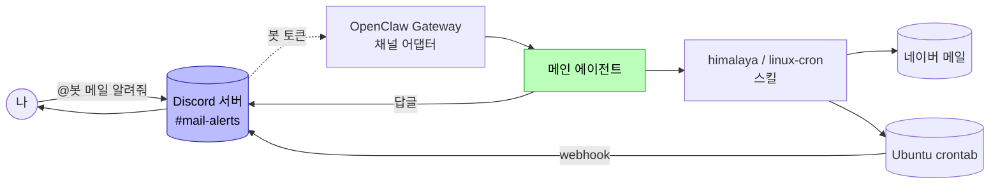
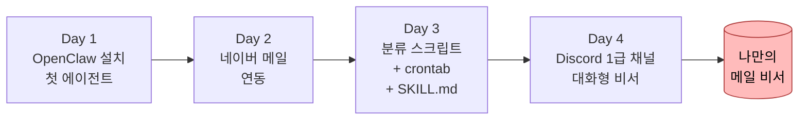

# Day 4: Discord 연결 + 대화형 비서
{: .no_toc }

총 4시간 (강의·실습 3시간 + Q&A 1시간)
{: .fs-5 .fw-300 }

<details open markdown="block">
<summary>목차</summary>
{: .text-delta }
1. TOC
{:toc}
</details>

## 학습 목표

- Discord 채널을 OpenClaw에 1급 채널로 등록한다
- 봇 토큰을 셸 재시작 후에도 자동 로드되게 영속화한다
- Discord webhook을 발급해 Day 3에서 만든 cron 결과를 채널로 자동 알림 받는다
- Discord 채널 안에서 자연어로 메일 조회·요약을 처리한다
- Day 3의 `linux-cron` SKILL을 통해 자연어로 **Ubuntu crontab을 운영**(상태 확인·통계·주기 수정·수동 실행)한다

## 시간표

| 시간 | 블록 | 내용 |
|---|---|---|
| 0:00–0:50 | 1 | Discord 채널 등록 / 봇 토큰 영속화 / webhook 발급 / Gateway 첫 기동 |
| 1:00–1:50 | 2 | 첫 대화 / 자연어 메일 조회·요약 |
| 2:00–2:50 | 3 | 자연어로 crontab 운영 + cron 결과 Discord 자동 알림 (클라이맥스) |
| 3:00–4:00 | Q&A | 트러블슈팅 + 강의 전체 회고 |

---

## 사전 확인

- Day 1~3 완료: OpenClaw 설치, Gemini 연동, 네이버 메일 연동, `spam-filter.sh` + Ubuntu crontab + `linux-cron` SKILL 동작 검증
- [기본 설정](00-pre-assignment.html) 5단계 완료: Discord 봇 생성 + 토큰 + 본인 서버 초대
- 봇 인텐트 3종 ON: **PRESENCE / SERVER MEMBERS / MESSAGE CONTENT**

> 봇 토큰을 분실했으면 Developer Portal → Bot → **Reset Token** 으로 새로 발급. 이전 토큰은 자동 무효화됩니다.
{: .note }

---

## Block 1: Discord 채널 등록 + 토큰·webhook 영속화

### 왜 "1급 채널"인가

지금까지 강의에서 OpenClaw 에이전트와 대화한 곳은 모두 터미널이었습니다. Day 4에서는 같은 에이전트가 **Discord 채널 자체를 입출력 통로**로 갖게 됩니다. 메일·cron 같은 도구를 부르는 두뇌는 그대로, **앞단의 대화창만 Discord로** 바뀌는 구조입니다.



봇과 webhook이 **두 가지 다른 메커니즘**으로 같은 Discord 채널에 들어옵니다:

- **봇** — 사용자 대화 응답 (양방향)
- **webhook** — cron 결과 자동 푸시 (한방향, 봇 토큰과 무관)

### 1-1. 봇 토큰을 환경변수로 공급

OpenClaw는 토큰을 평문으로 설정 파일에 박지 않습니다. 대신 **환경변수 참조(env-ref)** 방식을 씁니다. OpenClaw는 "이 채널의 토큰은 `DISCORD_BOT_TOKEN` 환경변수에서 읽어와" 라는 지시만 가지고, 실제 값은 매번 실행 시점에 환경에서 가져옵니다.

먼저 셸에 한 번 export:

```bash
export DISCORD_BOT_TOKEN="여기에_실제_봇_토큰_붙여넣기"
```

### 1-2. Discord 채널을 OpenClaw에 등록

```bash
openclaw config set channels.discord.token \
  --ref-provider default \
  --ref-source env \
  --ref-id DISCORD_BOT_TOKEN
```

설정이 들어갔는지 확인:

```bash
openclaw config get channels.discord
```

`token.refSource: env`, `refId: DISCORD_BOT_TOKEN` 이 보이면 정상.

> 토큰 값 자체는 출력에 안 나옵니다. 이게 정상이에요(평문 저장 안 함).
{: .note }

### 1-3. Discord webhook 발급 (cron 결과 자동 알림 채널)

webhook은 봇과 **별개로** 동작하는 한방향 푸시 채널입니다. Day 3에서 만든 `spam-filter.sh` 가 cron으로 돌면서 결과를 이 webhook URL로 보냅니다.

#### Discord 클라이언트에서 발급

1. `#mail-alerts` 채널 우클릭 → **채널 편집** → **연동(Integrations)**
2. **웹후크** → **새 웹후크**
3. 이름: `spam-filter` (자유), 채널: `#mail-alerts`
4. **웹후크 URL 복사** — `https://discord.com/api/webhooks/<숫자>/<토큰>` 형식

### 1-4. 토큰·webhook을 한 파일에 영속화

`export` 만 쓰면 **셸 창을 닫거나 WSL을 재시작하는 순간 환경변수가 날아갑니다**. 매번 다시 입력하지 않도록 두 값을 같이 파일에 저장합니다.

#### 시크릿 파일 만들기

Day 3에서 자리만 만들어둔 `~/.openclaw/secrets/discord.env` 파일을 채웁니다.

```bash
mkdir -p ~/.openclaw/secrets

cat > ~/.openclaw/secrets/discord.env <<'EOF'
export DISCORD_BOT_TOKEN="여기에_실제_봇_토큰_붙여넣기"
export DISCORD_WEBHOOK_URL="여기에_웹후크_URL_붙여넣기"
EOF

chmod 600 ~/.openclaw/secrets/discord.env
```

`chmod 600` 은 **본인 외 다른 사용자는 읽기도 못 함**을 의미합니다.

> `<<'EOF'` 의 작은따옴표가 중요합니다. 없으면 `$DISCORD_BOT_TOKEN` 같은 표현이 미리 치환되어 빈 값으로 저장될 수 있습니다.
{: .warning }

#### `~/.bashrc` 자동 로드

이미 Day 3에서 등록했다면 건너뜁니다. 아직이면:

```bash
cat >> ~/.bashrc <<'EOF'

# OpenClaw secrets
[ -f ~/.openclaw/secrets/discord.env ] && . ~/.openclaw/secrets/discord.env
EOF
```

#### 현재 셸에 즉시 적용 + 검증

```bash
source ~/.bashrc
echo "token: ${DISCORD_BOT_TOKEN:0:10}..."
echo "webhook: ${DISCORD_WEBHOOK_URL:0:40}..."
```

두 줄 다 값이 보이면 정상.

#### 재시작 시뮬레이션 (선택)

PowerShell 관리자에서 `wsl --shutdown` 후 다시 Ubuntu 열기 → 위 두 echo가 그대로 살아있어야 함.

### 1-5. webhook 즉시 검증 — cron 결과가 채널로

Day 3에서 만든 스크립트를 수동 실행해 webhook 경로를 검증합니다:

```bash
~/.openclaw/scripts/spam-filter.sh
```

1~2분 뒤 `#mail-alerts` 채널에 다음과 같은 메시지가 떠야 정상:

```
[spam-filter] 2026-05-13 11:00
검사 10통 / 스팸 0 / ham 10
이동 완료: 0통 → ai-test
```

> webhook 메시지의 발신자명은 봇과 다르게 보입니다(웹후크 이름 그대로 `spam-filter` 등). 이게 **자동 알림과 봇 대화를 시각적으로 구분**하는 효과가 있어요.
{: .note }

### 1-6. Gateway 기동

```bash
openclaw gateway
```

로그에 다음 줄들이 떠야 정상:

```
[gateway] starting...
[gateway] ready
[discord] connected as MailAssistant#1234
[discord] guild=<내 서버 이름> ready
[skills] loaded: himalaya, linux-cron
```

Discord 클라이언트에서 본인 서버 멤버 목록을 보면 봇이 **온라인(녹색)** 으로 떠 있어야 합니다.

> 강의 중에는 **`openclaw gateway` (foreground)** 로 별도 터미널에서 띄워두기를 권장합니다. cron 스크립트가 `openclaw infer model run --gateway` 로 Gateway를 통해 LLM 호출하므로, Gateway가 꺼지면 cron도 LLM 호출 실패합니다.
{: .important }

---

## Block 2: 첫 대화 — 메일을 자연어로 다루기

### 2-1. 봇에게 말 거는 두 가지 방식

| 위치 | 멘션 필요 | 용도 |
|---|---|---|
| 서버 채널 (예: `#mail-alerts`) | ✅ `@봇이름` | 다른 사람과 공용 채널일 때 봇을 명시 호출 |
| 봇과의 1:1 DM | ❌ 본문만 | 본인만의 비서, 가장 단순 |

강의 진행은 서버 채널 + 멘션 기준으로 합니다.

### 2-2. 시나리오 1 — 자기 소개

`#mail-alerts` 채널에서:

```
@MailAssistant 연동된 메일이 뭐야?
```

봇 응답 예시:

```
연동된 메일은 xxx@naver.com (네이버 메일)이에요
  - 계정 이름: naver
  - 백엔드: IMAP (수신) + SMTP (발신)
  - 기본 계정으로 설정됨
```

> 가끔 봇이 첫 한두 마디에 다른 메일 서비스(예: gmail)를 말하고 곧바로 정정하는 경우가 있습니다. LLM의 환각 현상이며, **두 번째 응답부터는 도구를 실제로 호출**해 정확해집니다.
{: .note }

### 2-3. 시나리오 2 — 최신 메일 요약

```
@MailAssistant 가장 최신 메일 요약해줘
```

기대 동작:

1. `himalaya envelope list -a naver -s 1` 으로 최신 1통 envelope
2. `himalaya message read ...` 로 본문
3. LLM이 사람 톤으로 요약

응답 예시:

```
가장 최신 메일 요약
  • 제목: 휴면회원 개인정보 파기 예정 안내
  • 발신: membership@example.co.kr
  • 수신: 2026-05-12 16:07

본문 요약: 1년 이상 미이용 휴면 회원의 정보가 6월 11일에 파기될 예정.
계정 유지하려면 그 전에 한 번 로그인하면 돼요.
```

Gateway 터미널에 `[skill] himalaya: ...` 줄이 떠야 **실제 도구가 호출된 것**. 안 뜨면 LLM이 환각으로 답한 거예요.

### 2-4. 시나리오 3 — 폴더별 조회

```
@MailAssistant ai-test 폴더에 뭐 들어있어?
```

기대 동작: `himalaya envelope list -a naver -f ai-test` 호출 + 자연어 요약.

이 시점부터 학생은 **봇이 단순 챗봇이 아니라 메일 도구를 직접 부르는 비서**라는 걸 체감하게 됩니다.

---

## Block 3: 자연어로 crontab 운영 (클라이맥스)

이 블록이 4일 강의의 **클라이맥스** 입니다. Day 3에서 등록한 Ubuntu crontab + `spam-filter.sh` 자동화를 **Discord 채널에서 자연어로 운영**합니다. 봇이 사용하는 매뉴얼은 Day 3에서 손수 작성한 `linux-cron` SKILL.md 한 장.

### 3-1. 시나리오 4 — 스케줄 확인

```
@MailAssistant 스케줄 확인해줘
```

봇이 `linux-cron` SKILL을 발동 → `crontab -l` 호출 → 결과를 표로 정리:

```
Ubuntu crontab — 활성 1개

| 주기                 | 다음 실행          | 작업          |
|---------------------|-------------------|--------------|
| 0 * * * * (매시 정각) | 12분 후 (12:00)    | spam-filter  |

스크립트: ~/.openclaw/scripts/spam-filter.sh
로그: ~/.openclaw/logs/spam-filter.cron.log
```

> 학생이 cron 5필드 표기를 외울 필요가 **전혀 없습니다**. Day 3에서 만든 `~/.openclaw/workspace/skills/linux-cron/SKILL.md` 한 장이 봇의 "crontab 운영 능력"을 통째로 정의해두었기 때문입니다. 이게 Day 3에서 강조한 **"자연어 SKILL.md = 에이전트의 새 능력"** 패턴이 실제로 동작하는 모습이에요.
{: .important }

### 3-2. 시나리오 5 — 오늘 분류 통계

```
@MailAssistant 오늘 분류 결과 통계 알려줘
```

봇이 `~/.openclaw/logs/spam-filter.jsonl` 을 jq로 집계:

```
오늘 분류 결과 (2026-05-13)
  • ham: 23통
  • spam: 2통

이동된 메일: 2통 → ai-test 폴더
```

### 3-3. 시나리오 6 — 최근 분류 로그

```
@MailAssistant 최근 분류 로그 보여줘
```

JSONL을 사람이 읽기 쉽게 변환:

```
최근 분류 5건

| 시각        | 제목                                       | 결과  |
|-------------|--------------------------------------------|------|
| 11:00:14    | 디즈니+ 약관 변경 안내                      | ham  |
| 11:00:25    | 빽다방 휴면회원 개인정보 파기 안내           | ham  |
| 10:38:09    | [광고] 무료체험 마지막 기회!                 | spam |
| ...                                                                |
```

### 3-4. 시나리오 7 — 수동 실행 (지금 한번 돌려봐)

```
@MailAssistant 지금 한번 실행해봐
```

봇이 백그라운드 실행:

```
수동 실행 트리거 완료
스크립트를 백그라운드로 돌렸어요. LLM 분류가 한 통당 5~15초 정도 걸려서
약 1~2분 뒤 이 채널에 webhook으로 결과가 도착할 거예요.
```

1~2분 뒤 같은 채널에 webhook 메시지(시나리오 1-5와 동일 형식)가 자동으로 도착:

```
[spam-filter] 2026-05-13 14:23
검사 10통 / 스팸 1 / ham 9
이동 완료: 1통 → ai-test
```

여기서 **두 가지 발신자**(봇 / webhook)가 한 채널에 자연스럽게 공존하는 모습을 학생이 보게 됩니다.

### 3-5. 시나리오 8 — 주기 변경

```
@MailAssistant 주기를 30분으로 바꿔줘
```

봇 응답:

```
crontab 갱신 완료

| 항목      | 변경 전        | 변경 후         |
|----------|---------------|-----------------|
| 주기      | 0 * * * *      | */30 * * * *    |
| 다음 실행 | 12:00          | 11:30           |
```

내부적으로는 봇이 `crontab -l | grep -v spam-filter; echo "*/30 ..."  | crontab -` 패턴을 실행합니다. 학생은 한국어로 말하면 끝.

검증 후 원복:

```
@MailAssistant 1시간 주기로 되돌려줘
```

---

## 강의 전체 회고



- **Day 1** — 에이전트의 두뇌(LLM) 와 손발(스킬/도구) 구조 이해
- **Day 2** — 외부 서비스(네이버 IMAP)를 스킬로 연결
- **Day 3** — **SKILL.md 한 장으로 에이전트의 능력을 늘리는** OpenClaw 고유 패턴 체득 (Ubuntu cron 운영을 자연어로)
- **Day 4** — 채팅 UI(Discord)를 통째로 입출력 통로로 바꿔도 두뇌·스킬은 그대로. cron 결과는 webhook으로 자동 알림.

비전공자가 16시간 만에 도달한 지점이 **"채팅 UI · 자동화 스케줄 · 외부 서비스 · LLM 두뇌를 한 사람이 운영하는 비서"** 라는 점이 강의의 결론입니다.

---

## 더 가볼 곳

- **다른 채널 어댑터** — Slack, Telegram, KakaoWork. 채널 어댑터만 갈아끼우면 같은 비서를 다른 메신저에서 사용할 수 있습니다.
- **다른 도구 스킬 추가** — Notion, Google Calendar, Linear 등. `SKILL.md` 한 장으로 추가됩니다 (Day 3 패턴 그대로).
- **분류 외 다른 자동화** — 정기 리포트 메일 요약, 회의 일정 자동 정리, 뉴스레터 모아 읽기.
- **GitHub Actions + crontab 대체** — 본인 PC가 꺼져 있어도 돌도록 클라우드 cron으로 옮기기.

---

## 트러블슈팅

### Gateway는 떴는데 봇이 오프라인

1. Discord 봇 인텐트 3종(**PRESENCE / SERVER MEMBERS / MESSAGE CONTENT**) 모두 ON 되어 있는지
2. 봇 초대 URL OAuth scope에 `bot`, 권한에 `Read/Send Messages`, `Read Message History` 포함됐는지
3. Gateway 로그에 `[discord] connected as ...` 가 떴는지 → 안 떴으면 토큰 문제

### 봇이 DM에선 응답하는데 서버 채널에선 답이 없음

서버 채널에선 반드시 **`@봇이름` 멘션**이 필요합니다. 멘션 없이 본문만 보내면 봇은 무시합니다(`requireMention: true` 기본값).

### `SecretRefResolutionError: ... DISCORD_BOT_TOKEN is missing or empty`

새 셸이나 WSL 재시작 후 환경변수가 풀려있는 경우.

```bash
echo "${DISCORD_BOT_TOKEN:0:10}..."
```

빈 줄이면 [1-4 영속화](#1-4-토큰webhook을-한-파일에-영속화) 단계가 누락된 것:

1. `cat ~/.openclaw/secrets/discord.env` — 파일 안에 실제 토큰이 들어있는지
2. `ls -l ~/.openclaw/secrets/discord.env` — 권한이 `-rw-------` 으로 나오는지
3. `grep openclaw ~/.bashrc` — source 라인이 들어가 있는지

### cron이 돌긴 했는데 Discord webhook 메시지가 안 옴

```bash
echo "${DISCORD_WEBHOOK_URL:0:40}..."
```

빈 줄이면 webhook URL이 환경변수에 들어와 있지 않은 상태. 스크립트는 webhook URL이 없으면 콘솔 출력 fallback으로 동작합니다. `~/.openclaw/secrets/discord.env` 에 `DISCORD_WEBHOOK_URL` 줄이 있는지 확인.

cron이 자동으로 호출하는 경우엔 crontab 한 줄의 `BASH_ENV=$HOME/.openclaw/secrets/discord.env` 부분이 있어야 cron 비대화형 셸이 시크릿을 가져갑니다.

### 봇이 옛 OpenClaw cron 컨텍스트로 응답

OpenClaw 워크스페이스 메모리에 옛 운영 지식이 박혀 있을 수 있어요. 찾아서 갱신:

```bash
grep -rln "openclaw cron list" ~/.openclaw/ 2>/dev/null
```

발견된 파일의 해당 항목을 새 정책(`linux-cron` / Ubuntu crontab)으로 수정.

### Gemini 한도 초과

Gemini 2.5 Flash 무료 티어는 **분당 15회 / 일 1500회**. 강의 중 학생이 봇과 연속으로 대화하면 분당 한도에 닿을 수 있습니다.

- 30초 대기 후 재시도
- crontab 주기를 1시간 → 더 길게(`0 */2 * * *` 2시간 등) 변경해 호출량 감소
- Pro Claude CLI 사용자라면 OpenClaw 라우팅이 자동으로 Claude로 갑니다([Day 1 §2.5](01-day1-setup.html#2-5-선택-pro-구독자용-claude-cli-경로))

---

## 자주 묻는 질문

**Q. 봇 토큰이 유출되면 어떻게 되나요?**
다른 사람이 본인 봇으로 본인 서버에 메시지를 보내거나 메시지를 읽을 수 있게 됩니다. Developer Portal → Bot → **Reset Token** 으로 즉시 무효화하세요. 이전 토큰은 자동으로 죽습니다.

**Q. webhook URL이 유출되면요?**
유출된 URL로 누구나 본인 채널에 메시지를 보낼 수 있습니다(읽기는 불가). 채널 설정 → 연동 → 해당 webhook 삭제 후 새로 발급하세요.

**Q. 강의 끝나고 봇·자동화를 끄려면?**

- 봇: Gateway 터미널에서 `Ctrl+C`
- 자동 분류 cron: `@봇 cron 삭제해줘` 또는 `crontab -l | grep -v spam-filter | crontab -`
- webhook: 채널 설정 → 연동 → webhook 삭제

**Q. 봇이 답을 너무 길게 합니다.**
Discord 한 메시지 상한이 2000자라 봇이 알아서 잘라 보내거나 분할합니다. 더 짧게 만들려면 봇에게 `짧게 답해줘` 같은 톤 지시를 평소 대화에 섞으면 LLM이 자연스럽게 반영합니다.

**Q. 다른 사람이 우리 서버에서 봇에게 명령을 내려도 동작하나요?**
기본 설정에선 네. 특정 사용자만 허용하고 싶다면:

```bash
openclaw config set channels.discord.guilds.<GUILD_ID>.users '["<MY_USER_ID>"]'
```

**Q. 강의 자료에 없는 명령을 봇이 알아들을까요?**
봇은 `~/.openclaw/workspace/skills/` 아래 모든 SKILL.md를 자동 로드합니다. 거기 정의된 도구 범위 안의 자연어 표현은 대부분 알아듣습니다. 범위 밖 명령(예: 일정 관리)을 시키려면 새 SKILL.md를 추가하면 됩니다 — Day 3 패턴 그대로.

**Q. crontab은 PC가 꺼지면 안 도나요?**
맞습니다. WSL이나 Ubuntu가 꺼져 있으면 cron도 안 돕니다. 24시간 돌게 하려면 클라우드(VPS, GitHub Actions, Cloudflare Workers Cron 등)로 옮겨야 합니다. 강의 범위 밖이지만 다음 단계로 좋은 주제예요.
